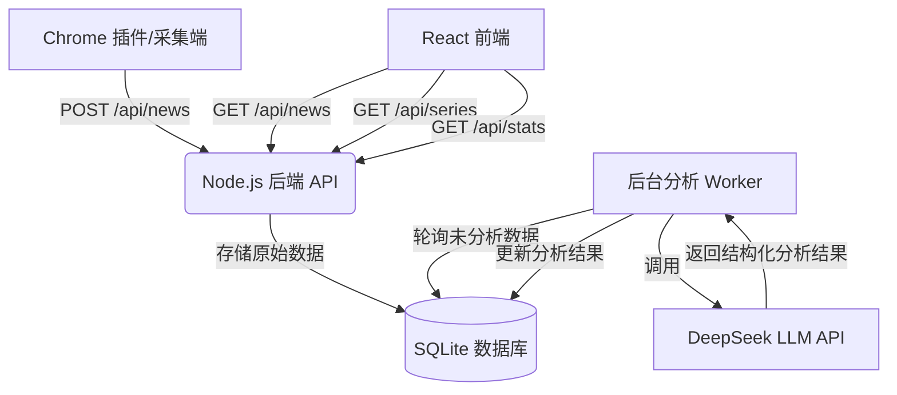

# 智能新闻分析与连续剧追踪系统 (Smart News Analysis & Series Tracking System)

## 1. 系统简介
本项目是一个基于大语言模型（LLM）的智能新闻聚合与分析平台。旨在解决信息过载问题，从海量杂乱的财经新闻中自动提取高价值信息，并将碎片化的单条新闻串联成有脉络的“连续剧”式事件发展史，帮助用户快速把握市场动态和核心事件。

## 2. 核心功能

### 2.1 智能分析与去噪
*   **自动去噪**：自动识别并过滤广告、水文和低价值信息。
*   **客观评分**：基于新闻实质内容进行 0-10 分的重要性打分，高分新闻（≥8分）视觉高亮。
*   **结构化提取**：
    *   **智能摘要**：生成 <50 字的客观事实摘要。
    *   **关键实体**：自动提取提及的公司、人物、机构等。
    *   **事件标签**：自动归类事件类型（如：财报业绩、监管政策）。

### 2.2 连续剧式主题追踪 (Series Tracking)
*   **自动聚合**：利用 LLM 提取的 `event_tag`（事件标签）和 `topic`（主题），自动将相关联的新闻聚合在一起。
*   **时间轴展示**：以时间轴形式展示特定事件（如“OpenAI人事变动”）的发展脉络，从起因到结果一目了然。
*   **关联推荐**：在单条新闻卡片中直接跳转至对应的事件连续剧视图。

### 2.3 实时监控台
*   **任务状态监控**：实时显示后台分析任务的运行状态（运行中/暂停）、当前正在分析的新闻标题。
*   **数据统计**：展示今日采集总量、待分析队列长度、高价值新闻数量及活跃事件数。
*   **人工干预**：支持手动暂停/启动分析任务。

## 3. 技术架构

### 3.1 架构图示


### 3.2 技术栈
*   **后端 (Server)**
    *   **Runtime**: Node.js
    *   **Framework**: Koa 2
    *   **Database**: SQLite 3 (轻量级本地存储)
    *   **AI Service**: DeepSeek API (兼容 OpenAI SDK)
    *   **Key Modules**: 
        *   `analyze.js`: 核心分析循环，负责任务调度。
        *   `llm.js`: 封装 LLM 调用逻辑，包含专门设计的 Prompt。
*   **前端 (Client)**
    *   **Framework**: React 18 + Vite
    *   **UI Library**: Ant Design 5
    *   **Routing**: React Router 6
    *   **HTTP Client**: Axios
*   **数据采集 (Extension)**
    *   Chrome Extension Manifest V3

## 4. 项目结构

```
message-analysis/
├── client/                 # 前端项目
│   ├── src/
│   │   ├── pages/
│   │   │   ├── NewsFeed.jsx    # 实时情报流（主监控台）
│   │   │   ├── SeriesView.jsx  # 连续剧追踪视图
│   │   │   └── Trends.jsx      # 趋势分析
│   │   └── services/           # API 封装
├── server/                 # 后端服务
│   ├── index.js            # API 入口
│   ├── analyze.js          # 分析任务 Worker
│   ├── llm.js              # LLM 接口封装
│   ├── database.js         # 数据库操作
│   └── news.db             # SQLite 数据库文件
├── extension/              # Chrome 采集插件
└── SYSTEM_INTRODUCTION.md  # 本文档
```

## 5. 快速开始

### 5.1 环境要求
*   Node.js >= 16
*   pnpm (推荐) 或 npm
*   DeepSeek API Key (配置在 `server/.env`)

### 5.2 一键启动 (推荐)
本项目提供了一键启动脚本，可同时启动前端和后端服务。

**Mac/Linux:**
```bash
# 赋予执行权限（仅首次需要）
chmod +x start.sh

# 启动
./start.sh
```

**或者使用 pnpm:**
```bash
# 安装依赖并启动
pnpm install
pnpm start
```

### 5.3 手动启动后端
```bash
cd server
# 复制环境变量配置
cp .env.example .env
# 编辑 .env 填入 DEEPSEEK_API_KEY
pnpm install
node index.js
# 服务将启动在 http://localhost:3001
```

### 5.4 手动启动前端
```bash
cd client
pnpm install
pnpm dev
# 访问 http://localhost:5173
```

### 5.5 数据采集
1.  打开 Chrome 浏览器 -> 扩展程序 -> 加载已解压的扩展程序。
2.  选择 `extension` 目录。
3.  访问目标新闻网站（如 IT之家），插件将自动采集新闻并发送至后端。

## 6. 开发与维护
*   **修改 Prompt**: 编辑 `server/llm.js` 中的 `prompt` 变量，可调整提取规则。
*   **重置分析**: 运行 `node server/reset_analysis.js` 可清空所有分析结果并重新触发分析。
*   **数据库查看**: 使用 SQLite 客户端打开 `server/news.db` 查看原始数据。
