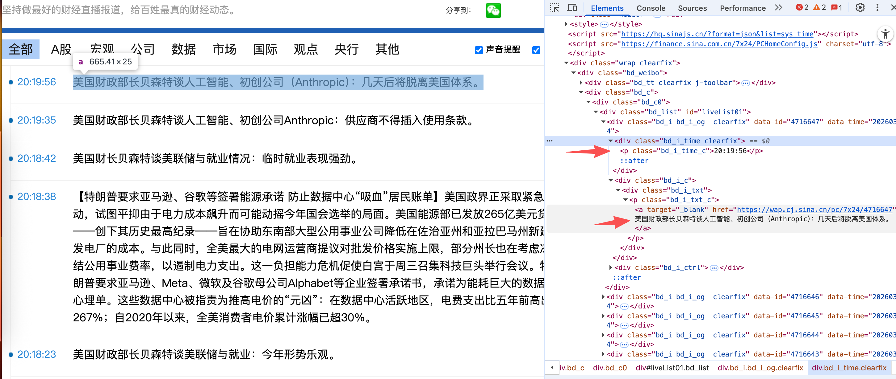

# 这是一个消息分析程序。
1. 收集消息
   1. 目标是在网页https://finance.sina.com.cn/7x24/上植入一个插件，获取消息，然后存入本地数据库
   2. 这个网站是7*24小时全球实时财经新闻直播，60秒定时刷新。
   3. 这是html结构
2. 设计一个后端，存储消息。
   1. 数据量会很大，要考虑性能
3. 消息分析与智能处理
   1. 数据清洗与去噪 (Pre-processing)
      1. 规则过滤：使用正则去除广告、免责声明等固定噪音。
      2. 价值评分：利用小模型快速判断新闻价值，过滤低价值水文。
   2. 语义匹配与向量化 (Embedding) - *解决关键词匹配的局限性*
      1. 将新闻内容转化为向量 (Vector)，存入向量数据库。
      2. 支持语义搜索：用户描述关注意图（如“高科技半导体”），系统通过语义相似度匹配新闻，而非死板的关键词。
   3. 投资关联分析 (LLM 推理)
      1. 接入大模型 (如 DeepSeek) 能力。
      2. 自动提取关键信息：从新闻文本中识别公司、行业、核心事件。
      3. 影响面推理：分析新闻对特定板块或用户持仓的潜在影响（利好/利空）。
      4. 趋势发现：分析特定时间段内的热点话题和情感倾向。
4. 管理后台与可视化看板
   1. 简单的 Web 界面，用于展示采集到的数据。
   2. 功能需求：
      1. 实时新闻流展示。
      2. 趋势图表（如热度曲线、情感分布）。
      3. 配置关注列表。